# Migrate AWS Elasticsearch to Alibaba Cloud

## Summary
1. [Abstract](#abstract)
2. [Introduction](#introduction)
3. [Pre-Requisites](#pre-requisites)
4. [Registering a Manual Snapshot Directory](#registering-a-manual-snapshot-directory)
5. [Snapshot and Restore for the first time](#snapshot-and-restore-for-the-first-time)
6. [Snapshot and Restore for the last time](#snapshot-and-restore-for-the-last-time)
7. [Conclusion](#conclusion)
8. [Further Reading](#further-reading)

## Abstract

In this document, you can find technical solution of ElasticSearch index migration from AWS to Alibaba Cloud.

Reference architecture diagram is showed below:

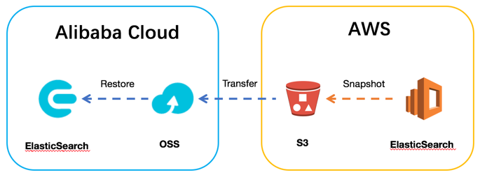


## Introduction

### Basic Concept


-   Elasticsearch

    A distributed, RESTful search and analytics engine capable of solving a
growing number of use cases. As the heart of the Elastic Stack, it centrally
stores your data so you can discover the expected and uncover the
unexpected.

-   Kibana

    An open-source tool to visualize your ElasticSearch data and navigate the Elastic Stack.

-   Amazon Elasticsearch Service

    Amazon
Elasticsearch Service is a fully managed service that delivers
Elasticsearch’s easy-to-use APIs and real-time analytics capabilities
alongside the availability, scalability, and security that production
workloads require. 

-   Alibaba Elasticsearch Service

    Alibaba Cloud Elasticsearch is based on the open-source Elasticsearch engine and provides commercial X-Pack plug-ins. Designed for scenarios such as search and analytics, Alibaba Cloud Elasticsearch features enterprise-level access control, security monitoring, and automatic updates.

-   Snapshot and Restore

    You can store snapshots of individual indices or an entire cluster in a
remote repository like a shared file system, S3, or HDFS. These snapshots
are great for backups because they can be restored relatively quickly.
However, snapshots can only be restored to versions of Elasticsearch that
can read the indices:
    - A snapshot of an index created in 5.x can be restored to 6.x.
    - A snapshot of an index created in 2.x can be restored to 5.x.
    - A snapshot of an index created in 1.x can be restored to 2.x.

    Conversely, snapshots of indices created in 1.x cannot be restored to
5.x or 6.x, and snapshots of indices created in 2.x cannot be restored
to 6.x.

    Snapshots are incremental and can contain indices created in various
versions of Elasticsearch. If any indices in a snapshot were created in an
incompatible version, you will not be able restore the snapshot.

### Solution Overview

ElasticSearch indices can be migrated with following steps:

Create Baseline indices

-   Create a snapshot repository and associate it to an AWS S3 Bucket

-   Create the first snapshot of the indices to be migrated, which is a full
    snapshot, the snapshot will be stored in AWS S3 bucket created in the first
    step automatically.

-   Create OSS Bucket on Alibaba Cloud, and register it to some snapshot
    repository of Alibaba Cloud ElasticSearch instance.

-   Use OSSImport tool to pull the data from AWS S3 bucket to Alibaba Cloud OSS
    bucket.

-   Restore this full snapshot to Alibaba Cloud ES instance.

Periodic Incremental Snapshots

-   Repeat several incremental snapshot and restore.

Final snapshot and Service Switchover

-   Stop the service which can modify index data

-   Create final incremental snapshot of AWS ES instance.

-   Transfer&Restore the final incremental snapshot to Alibaba Cloud ES
    instance.

-   Service switchovers to Alibaba Cloud ES instance.

## Pre-Requisites

### ElasticSearch service

Version number of AWS Elasticsearch is 5.5.2, located in the region Singapore.

Version number of Alibaba Cloud Elasticsearch is 5.5.3(the only version provided
now), located in Hangzhou.

The demo index name is **movies**.

### Manual Snapshot Prerequisites on AWS


Amazon ES takes daily automated snapshots of the primary index shards in a
domain, it stores these automated snapshots in a preconfigured Amazon S3
bucket for 14 days at no additional charge to you. You can use these
snapshots to restore the domain.

You cannot, however, use automated snapshots to migrate to new domains.
Automated snapshots are read-only from within a given domain. For
migrations, you must use manual snapshots stored in your own repository (an
S3 bucket). Standard S3 charges apply to manual snapshots.

To create and restore index snapshots manually, you must work with IAM and
Amazon S3. Verify that you have met the following prerequisites before you
attempt to take a snapshot.

| Prerequisite | Description                                                                                                                                                                                                                                                                                                                   |
|------------------|-----------------------------------------------------------------------------------------------------------------------------------------------------------------------------------------------------------------------------------------------------------------------------------------------------------------------------------|
| S3 bucket        | Stores manual snapshots for your Amazon ES domain.                                                                                                                                                                                                                                                                                |
| IAM role         | Delegates permissions to Amazon Elasticsearch Service. The trust relationship for the role must specify Amazon Elasticsearch Service in the Principal statement. The IAM role also is required to register your snapshot repository with Amazon ES. Only IAM users with access to this role may register the snapshot repository. |
| IAM policy       | Specifies the actions that Amazon S3 may perform with your S3 bucket. The policy must be attached to the IAM role that delegates permissions to Amazon Elasticsearch Service. The policy must specify an S3 bucket in a Resource statement.                                                                                       |

#### S3 Bucket

You need an S3 bucket to store manual snapshots. Make a note of its Amazon
Resource Name (ARN). You need it for the following:

-   Resource statement of the IAM policy that is attached to your IAM role

-   Python client that is used to register a snapshot repository

The following example shows an ARN for an S3 bucket:
```
arn:aws:s3:::eric-es-index-backups
```
#### IAM Role

You must have a role that specifies Amazon Elasticsearch
Service, es.amazonaws.com, in a Servicestatement in its trust relationship,
as shown in the following example:
```json
{
    "Version": "2012-10-17",
    "Statement": [
        {
            "Sid": "",
            "Effect": "Allow",
            "Principal": {
                "Service": "es.amazonaws.com"
            },
            "Action": "sts:AssumeRole"
        }
    ]
}
```
In AWS IAM Console, you can find Trust Relationship detail here:

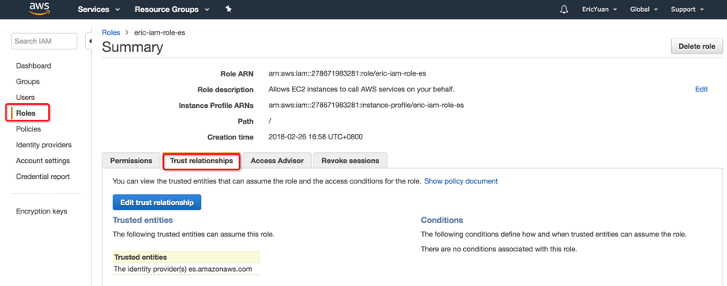

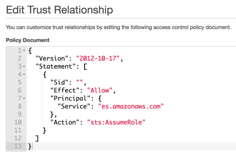

When you create an AWS service role using the IAM console, Amazon ES is not
included in the Select role type list. However, you can still create the
role by choosing Amazon EC2, following the steps to create the role, and
then editing the role's trust relationships to es.amazonaws.com instead
of ec2.amazonaws.com. 

#### IAM Policy

You must attach an IAM policy to the IAM role. The policy specifies
the S3 bucket that is used to store manual snapshots for your Amazon ES
domain. The following example specifies the ARN of
the eric-es-index-backups bucket:

```json
{
    "Version": "2012-10-17",
    "Statement": [
        {
            "Action": [
                "s3:ListBucket"
            ],
            "Effect": "Allow",
            "Resource": [
                "arn:aws:s3:::eric-es-index-backups"
            ]
        },
        {
            "Action": [
                "s3:GetObject",
                "s3:PutObject",
                "s3:DeleteObject"
            ],
            "Effect": "Allow",
            "Resource": [
                "arn:aws:s3:::eric-es-index-backups/"
            ]
        }
    ]
}
```

You need paste it here:

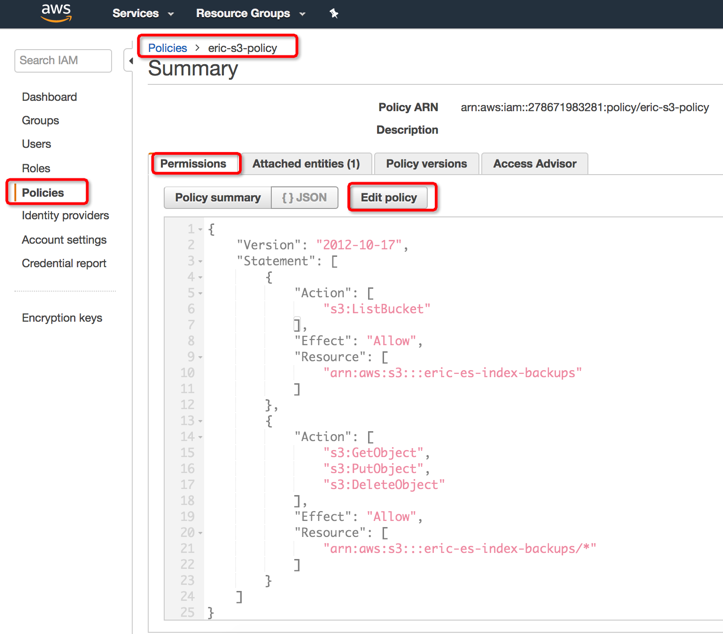

Another readable view:

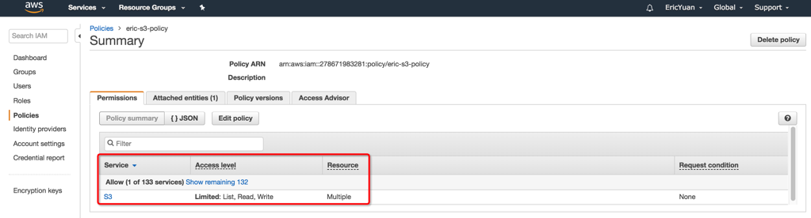

#### Attach IAM Policy to IAM Role

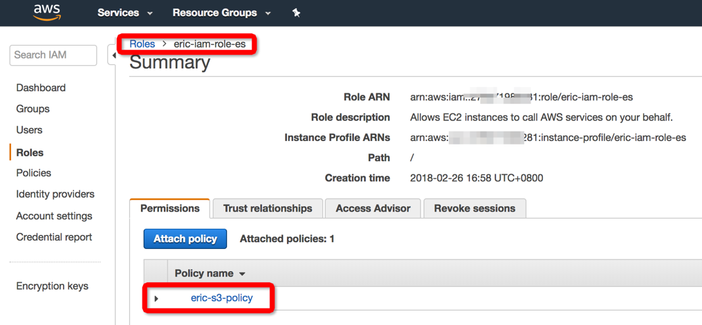

## Registering a Manual Snapshot Directory

You must register the snapshot directory with Amazon Elasticsearch Service
before you can take manual index snapshots. This one-time operation requires
that you sign your AWS request with credentials for one of the users or
roles specified in the IAM role's trust relationship.

You can't use curl to perform this operation because it doesn't support AWS
request signing. Instead, use the sample Python client to register your
snapshot directory.

### Modify Sample Python Client

Modify the values to your real value in
following sample code, then copy content of attachment into a python file
snapshot.py after customization

```python
from boto.connection import AWSAuthConnection

class ESConnection(AWSAuthConnection):

    def __init__(self, region, kwargs):
        super(ESConnection, self).__init__(kwargs)
        self._set_auth_region_name(region)
        self._set_auth_service_name("es")

    def _required_auth_capability(self):
        return ['hmac-v4']

if __name__ == "__main__":

    client = ESConnection(
            region='ap-southeast-1',
            host='search-ericdomain-lvdbd7shde2swqh45eo6abfsle.ap-southeast-1.es.amazonaws.com',
            aws_access_key_id='Put Your AWS Access Key ID here.',
            aws_secret_access_key=' Put Your AWS Secret Access Key here.', is_secure=False)

    print 'Registering Snapshot Repository'
    resp = client.make_request(method='PUT',
            path='/_snapshot/eric-snapshot-repository',
            data='{"type": "s3","settings": {“bucket":"eric-es-index-backups","region": "ap-southeast-1","role_arn": "arn:aws:iam::278671983281:role/eric-iam-role-es"}}',
            headers={'Content-Type': 'application/json'})
    body = resp.read()
    print body

```

| Variable name     | Description                                                                                                                                                                                                                                                                                                                                                                                                                                                                 |
|-----------------------|---------------------------------------------------------------------------------------------------------------------------------------------------------------------------------------------------------------------------------------------------------------------------------------------------------------------------------------------------------------------------------------------------------------------------------------------------------------------------------|
| region                | AWS Region where you created the snapshot repository                                                                                                                                                                                                                                                                                                                                                                                                                            |
| host                  | Endpoint for your Amazon ES domain                                                                                                                                                                                                                                                                                                                                                                                                                                              |
| aws_access_key_id     | IAM credential                                                                                                                                                                                                                                                                                                                                                                                                                                                                  |
| aws_secret_access_key | IAM credential                                                                                                                                                                                                                                                                                                                                                                                                                                                                  |
| path                  | Name of the snapshot repository                                                                                                                                                                                                                                                                                                                                                                                                                                                 |
| data                  | Must include the name of the S3 bucket and the ARN for the IAM role  |


### Install Amazon Web Services Library boto-2.48.0

This sample Python client requires that you install version 2.x of
the boto package on the computer where you register your snapshot
repository.
```console
prompt:~$ wget https://pypi.python.org/packages/66/e7/fe1db6a5ed53831b53b8a6695a8f134a58833cadb5f2740802bc3730ac15/boto-2.48.0.tar.gz#md5=ce4589dd9c1d7f5d347363223ae1b970
prompt:~$ tar zxvf boto-2.48.0.tar.gz
prompt:~$ cd boto-2.48.0
prompt:~$ python setup.py install
```

### Execute Python Client to Register Snapshot Directory

```console
prompt:~$ python snapshot.py
Registering Snapshot Repository
{"acknowledged":true}
```
Check result in KibanaDev Tools with request：
```
GET _snapshot
```
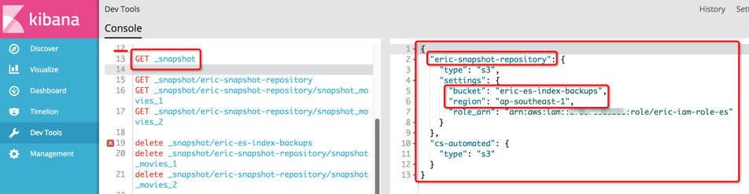

## Snapshot and Restore for the first time

### Take a snapshot manually on AWS ES

Following commands are all performed on KibanaDevTools, you can also
perform them in the format of curl command in Linux.

-   Take a snapshot with name snapshot_moives_1 only for the index
    movies in the repository eric-snapshot-repository.
```
PUT _snapshot/eric-snapshot-repository/snapshot_movies_1
{
    "indices": "movies"
}
```
-   Check snapshot status
```
GET _snapshot/ eric-snapshot-repository/snapshot_movies_1
```
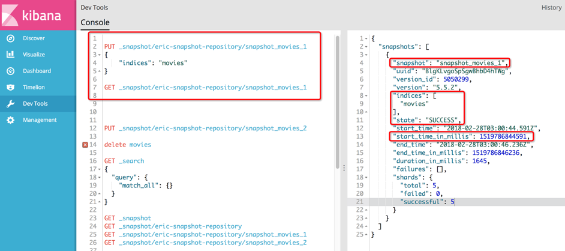

Check snapshot files on the AWS S3 console:

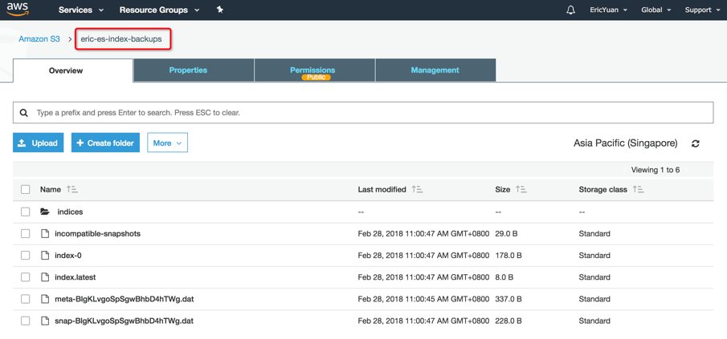

### Pull snapshot data from AWS S3 to Alibaba Cloud OSS

In this step, you need pull snapshot data from AWS S3 bucket to Alibaba
Cloud OSS.

Please refer to [Migrate data from Amazon S3 to Alibaba Cloud
OSS](https://www.alibabacloud.com/help/doc-detail/64919.htm)

After data transfer, check stored snapshot data on OSS console:

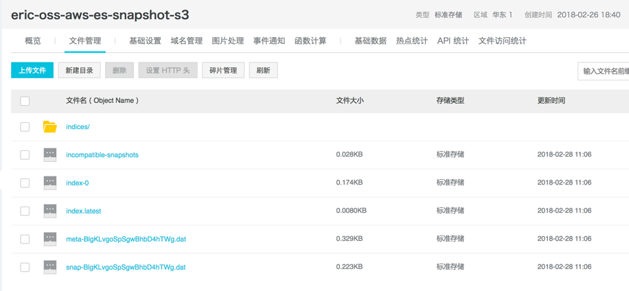

### Restore snapshot to Alibaba Cloud ES instance


#### Create Snapshot Repository

Perform following request on KibanaDev Tools to create snapshot
repository with same name, modify values with red color to your real ones.
```
PUT _snapshot/eric-snapshot-repository
{
    "type": "oss",
    "settings": {
        "endpoint": "http://oss-cn-hangzhou-internal.aliyuncs.com",
        "access_key_id": "Put your access key id here.",
        "secret_access_key": "Put your secret access key here.",
        "bucket": "eric-oss-aws-es-snapshot-s3",
        "compress": true
    }
}
```
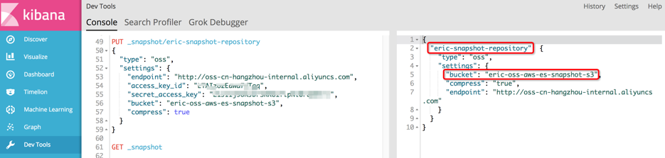

After creating the snapshot directory, check the snapshot status with
snapshot name snapshot_movies_1 which is assigned in AWS ES manual
snapshot step.

```
GET _snapshot/eric-snapshot-repository/snapshot_movies_1
```

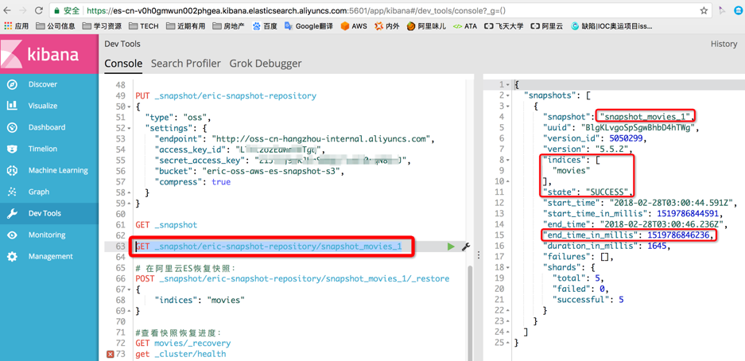

Please record the start/end time of this snapshot operation, it will
be used in future incremental snapshot data transfer by Alibaba Cloud
OSSimport tool.

"start_time_in_millis": 1519786844591
"end_time_in_millis": 1519786846236,

#### Restore snapshots

Perform following request on KibanaDev Tools
```
POST_snapshot/eric-snapshot-repository/snapshot_movies_1/_restore
{
    "indices": "movies"
}

GET movies/_recovery
```
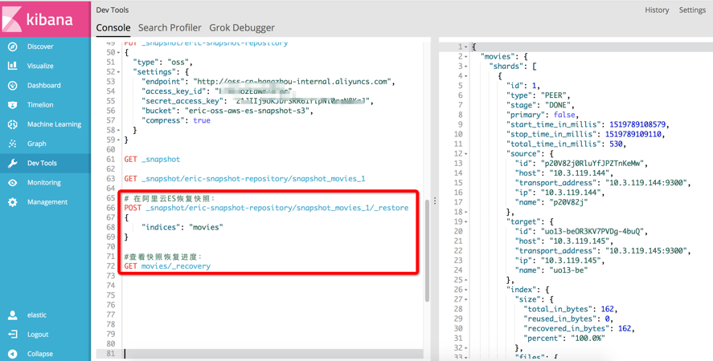

Check the availability of index movies on KibanaDiscover, we can see
there exists 3 records in the index movies, as same as AWS ES instance.

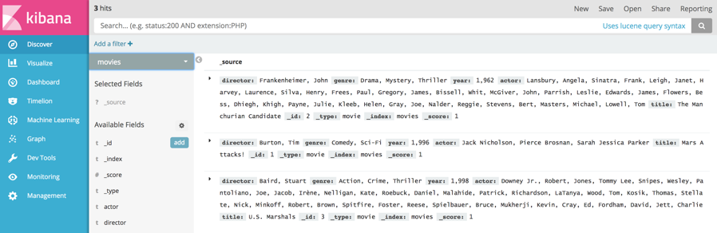

## Snapshot and Restore for the last time

### Create some sample data on AWS ES index movies

From above, we know that there are only 3 records in the index movies, so we
insert another 2 records.


or you can use request:
```
GET movies/_count
```

### Take another snapshot manually

Check the snapshot status:

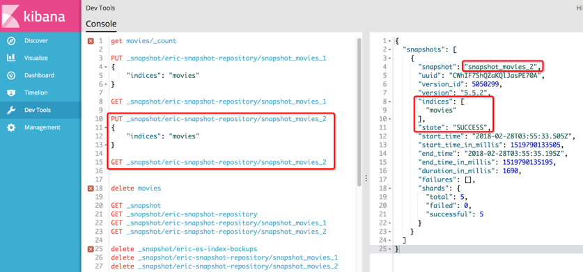

Check files on S3 bucket:

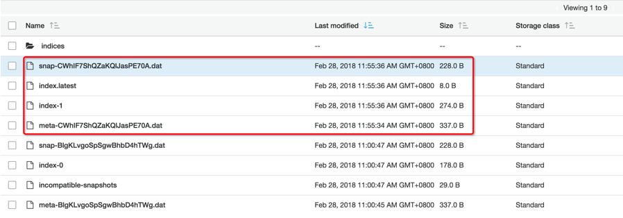

If you check the folder indices, you can also find some differences.

### Pull incremental snapshot data from AWS S3 to Alibaba Cloud OSS

You can also use OSSImport tool to migrate data from S3 to OSS, because
there are 2 snapshots files stored on S3 bucket now, so we try to migrate
difference data via modify the value of filed isSkipExistFile in the
configuration file local_job.cfg

| Filed           | Meaning                                                                      | Description                                                                                   |
|-----------------|------------------------------------------------------------------------------|-----------------------------------------------------------------------------------------------|
| isSkipExistFile | Whether to skip the existing objects during data migration, a Boolean value. | If it is set to true, the objects are skipped according to the size and LastModifiedTime. If it is set to false, the existing objects are overwritten. The default value is false. This option is invalid when jobType is set to audit.After OSSImport migration job complete, we can find only ‘new’ files are migrated to OSS.|

-   On Alibaba Cloud OSS bucket

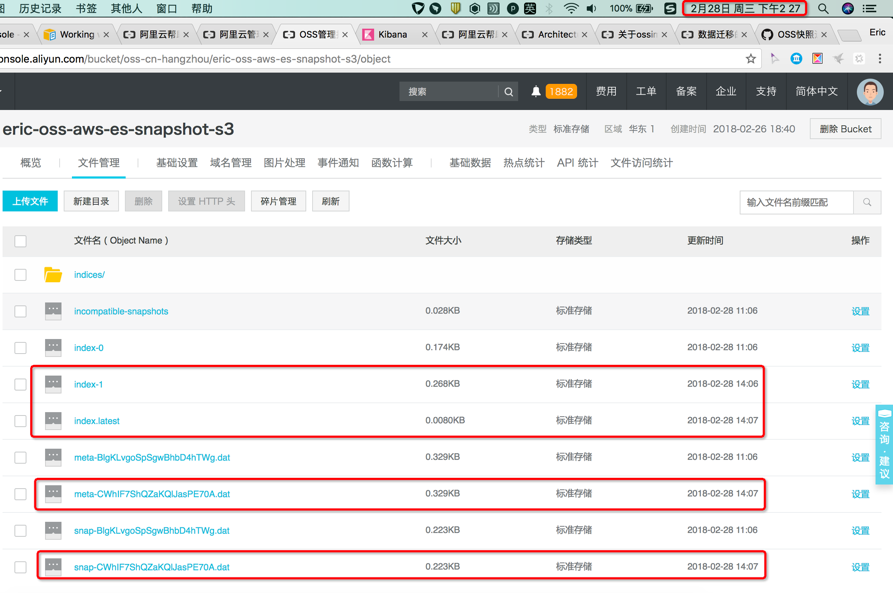

-   On AWS S3 bucket

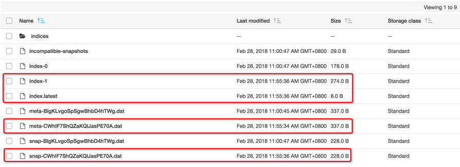

### Restore incremental snapshot

Can also follow the steps in the chapter **Restore snapshots**, but index **movies** is needed
to be close first, then restore the snapshot, open again after the restore.
```
POST /movies/_close

GET movies/_stats

POST _snapshot/eric-snapshot-repository/snapshot_movies_2/_restore
{
"indices": "movies"
}

POST /movies/_open
```
After restore procedure complete, we can see the count(5) of documents in
the index movies is as same as it is in AWS ES instance.

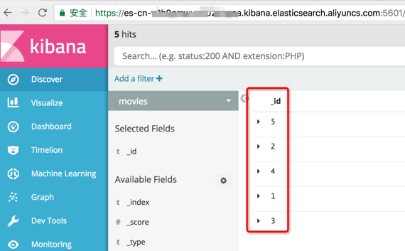

## Conclusion


It’s possible to migrate AWS Elasticsearch service data to Alibaba Cloud
Elasticsearch service via snapshot and restore method.

This migration technology solution requires AWS Elasticsearch instance to
stop writing business requests during the migration and recovery of the last
snapshot.

## Further Reading

-   https://www.elastic.co/guide/en/elasticsearch/reference/current/modules-snapshots.html

-   https://docs.aws.amazon.com/elasticsearch-service/latest/developerguide/es-managedomains-snapshots.html

-   https://www.alibabacloud.com/help/doc-detail/64919.htm

-   https://github.com/zhichen/elasticsearch-repository-oss/wiki/OSS%E5%BF%AB%E7%85%A7%E8%BF%81%E7%A7%BB

-   https://github.com/zhichen/elasticsearch-repository-oss/wiki/OSS%E5%BF%AB%E7%85%A7%E8%BF%81%E7%A7%BB

-   https://www.alibabacloud.com/help/doc-detail/56990.htm
